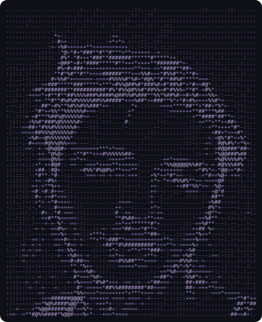

<!--
  ╔═══════════════════════════════════════════════════════════════╗
  ║   SANDIP SHRESTHA · PROFILE README                            ║
  ║   Built with intention. The face below is real ASCII, from    ║
  ║   an actual photo — rendered in brand purple. No filters.     ║
  ╚═══════════════════════════════════════════════════════════════╝
-->

<a id="top"></a>

<!-- ░░░ ANIMATED AURORA HEADER ░░░ -->


<!-- ░░░ HERO: ASCII PORTRAIT (real photo → characters) + TYPING TITLE ░░░ -->
<table align="center" width="100%" border="0">
  <tr>
    <td width="42%" align="center" valign="middle">
      <!-- This is YOUR face, rendered from your photo as colored ASCII. Commit assets/ascii-portrait.svg for it to show. -->
      
    </td>
    <td width="58%" align="left" valign="middle">
      
      <br/>
      <p><i>Student @ National School of Sciences · Building on the web, aiming at intelligence.</i></p>
      <a href="#"></a>
      <a href="#"></a>
      <a href="https://github.com/sanshre-sandip"></a>
      <br/><br/>
      
    </td>
  </tr>
</table>

<details align="center">
<summary><b>🖥️ &nbsp;Prefer raw terminal? Tap to see the plain-text ASCII portrait</b></summary>

```
...................:...:.........:................::.....:......
..................:...:........::...:...........................
.....:...........:.......:...:::..::.:...::.....................
...........::.....::.......:::......:...::......................
............++::.::.......:+=...:::....::.......................
...........:-*++:::.:-::.:=*+*::-:::::::..................:.....
..........:--=%*****##**+++=+=+=::-:-:::.::::...................
.........::::.*%-**+**#***######**#**++*+=:..:::...:............
.......:::::.-%#*=#+**##**#*#***+*+++*######+-:...:::::.....:...
.::...:-:::::##*###*+*++*++++++==**+=-+*####*#*=-::::-.:...:....
::...:-:::::+####***++==+##%##**+=*%%*+*##%#*+***---:.:..::::...
.:..:-::::-*###*++++++==++*#%%%#%#**%##*#*####*#*+*+::...::::...
...:-:-=+*###**#########**#**%%%#%##*#%*#*##%+*#*-*%*::::::.....
..::.-+++**###**###%#######%%#%%#%##**%###%%*+#*%==*%*::--:.::..
..-:::-===****##%%%%%%##%###*#++*#**+*##**#*+#*%*+=*%#*=--:.-:..
:-::::--=#*+##*#%%%#%***+--:.:.:#-.:.:--==+***#****#**%*--:-:...
-..::--*#**###%%%%%#+=-::.:....+-........:----=+*#######==::-:..
..::--+%#*###@%%%%#+=-::.::...==.......:::.....:-+*#***+*#=:-:..
.:--=+#**#%%%@%%%#=---::.:....=.......-:.......:::--+*+++*#+::..
:---===##%%%@%%%%=----::............::........:::----*#**=+#+-..
:::-:-##==@%%%%%*-----:............::........:::---=-:%%##++%*:.
:::-:=+-==#@%@%+==------=-::::....:.........:::::--=--*@%##+#*:.
:::::-:-+-=@%@+--=+******%%%###*=:..........::::::---=#@%####*:.
..::-::-===#@%---+*+=:...:=+++**+:.....:+++===--:::--=%@%%%#%=.:
.::-:::=*==*@#:-==--=++**++**++++=...:-=*#%%%%%%##*==-#@%%##*:::
:::::::=##--@=:--::=##+*###+**=+*+:..=#*++++=-:::=*#+-*@*=**--:.
::::::-+*=+*#--::...:==--:---::---...**=+**##++=-:-++=@#--=-:::.
::::::-+:=*%*=-:.......:..::::-:-:...+=:-=-*###*%*===*@=-::-:::.
:::-::-#-++=*+=::...........:::--:..:+--:--:-==++---=%**---::::.
:::::::++-=*#=+=::...........:---...:+--......:::::-+%#+-:--:.:.
-:..:--:+=-=#+=+-::.........-+-=:...:+=:..........:-##*--:-:.::.
-...::::=+-:+*-==-::.......-*:-=:....===.........:-+%*+----..:-.
:..::.::-+***%====:::......:**##*=--++-*........:-+%#*=--::::::.
:..::..----==#+-==-:.......:=**********:.....:::=+#*#=--::-..::.
:..:..:=---==*#--=-:.:--==-===**+++##*=......:-=+#*+*--::::.:-:.
:...::-=---===#+--=-:+*#+==+========+*++=-:.:-++*%++---:-:::-:..
....--=--=-:==+#=--=--=-+######******+==+*+:-+==%=---:-:.--::..:
:..-=---=-:--=-+%=----:..-+*=-=+#***##%*--==+==%+----:-::-:..::.
..:-=--=-:---=--##+==-::--=+*=---:-+**=:.:===+%#=----=:::::.::..
.:-------:----=-***#=--:::-=+#%%##*+==---=++##%*+---=--.:..::.:.
-----:--:--:-----#=+#*-::...:::----::::-=+##+=%+=====-.-..-:.:..
:-:----:--:=-----#+=+##+-::..........:=+##*=-=%#*=-+-:=::-:.:...
-::---:--:--:----=#==+*##*++-:--::--=*#*+=--:-%**#*=-=-.:.::.::.
::::-----=---:-:--#+==+++*#########*#*===-:::-#*-=++*+++-:-:.:.:
:::---------=+++*#@#===*+=-==++++++===-=-:::::**---:--=++++===::
-::-:----=*%%###@@%%*--++*===-===------::...::==-::.....::-*##**
::-----+*%@####%@%=*#=-=++*=:-====----::....:::::.........+#**#=
:==--**%@%###*%@%==*#*=-===*+++=-----:::....:............+#++*-:
```
</details>

---

<!-- ░░░ ABOUT — as a live code block ░░░ -->
##  &nbsp;whoami

```typescript
const sandip: Developer = {
  location:  "Kathmandu, Nepal 🇳🇵",
  role:      "Web Developer → AI/ML Engineer (in progress)",
  education: "Grade 12 · Physical Science @ NSS",

  currentlyBuilding: ["scalable APIs with FastAPI + Supabase", "RoomFinder", "Sestro", "Sanshre"],
  learning:          ["PyTorch", "Machine Learning foundations", "System Design"],

  philosophy: "Ship small, learn fast, refactor honestly.",
  funFact:    "Started with PHP — now shipping APIs and Flutter apps 🚀",

  openTo: ["collaboration", "open source", "internships"],
};
```

---

##  &nbsp;Arsenal

<div align="center">

**Languages**  


**Frontend & Mobile**  


**Backend & Data**  


**AI / ML** *(learning path)*  


**Tooling**  


</div>

---

##  &nbsp;By the numbers

<div align="center">


</div>

---

##  &nbsp;Contribution snake

<!-- Auto-generated by the snake.yml workflow (see setup notes at the bottom of this file). -->
<div align="center">
  
</div>

## 🧊 &nbsp;3D contribution calendar

<!-- Auto-generated by the profile-3d-contrib workflow. -->
<div align="center">
  
</div>

---

## 🏆 &nbsp;Trophies & activity

<div align="center">
  
</div>

<div align="center">
  
</div>

---

## 🌟 &nbsp;Highlights

> ### 🥇 Top 11 Teams — AIDEA Hackathon
> Organized by the **U.S. Embassy Nepal**, **Dapper Studio House** & **Clock b Business Innovation**.  
> Built an AI-driven solution with real-world impact, from problem framing to working prototype.

<table>
<tr>
<td width="33%" align="center">🚀<br/><b>Real projects, shipped</b><br/><sub>RoomFinder · Sestro · Sanshre</sub></td>
<td width="33%" align="center">📚<br/><b>Consistent learner</b><br/><sub>Open-source contributor</sub></td>
<td width="33%" align="center">💡<br/><b>Now building</b><br/><sub>Scalable APIs · FastAPI + Supabase</sub></td>
</tr>
</table>

---

## 💬 &nbsp;A thought to compile by

<div align="center">
  
</div>

---

<div align="center">

### 📫 &nbsp;Let's build something

<a href="#"></a>
<a href="#"></a>

<sub><i>"Started with PHP, now building APIs & Flutter apps." — the journey continues.</i></sub>

<a href="#top">⬆️ back to top</a>

</div>


<!--
════════════════════════════════════════════════════════════════════════
  ONE-TIME SETUP (do these so every dynamic piece renders):

  1. ASCII PORTRAIT
     Commit  assets/ascii-portrait.svg  to this repo (provided alongside
     this README). That's what makes your face show at the top.

  2. CONTRIBUTION SNAKE  →  .github/workflows/snake.yml
     Generates snake.svg on the `output` branch every 12h.

  3. 3D CONTRIB CALENDAR →  .github/workflows/3d-contrib.yml
     Generates the profile-3d-contrib SVGs on the `output` branch.

  Both workflow files are provided next to this README. After the first
  successful Actions run, an `output` branch appears and the images light up.
════════════════════════════════════════════════════════════════════════
-->
